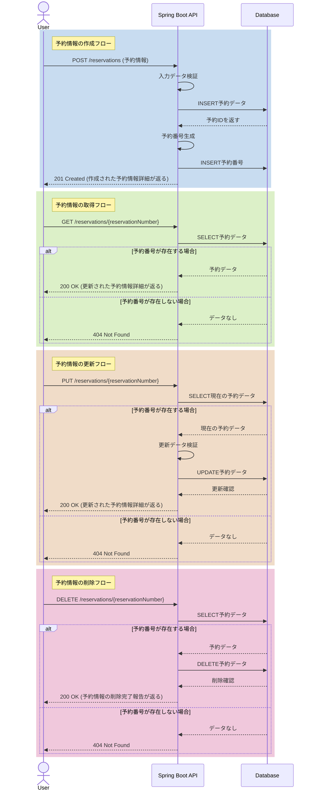

# ねこカフェ予約管理システムについて

 
 

- ## 作成背景（Background）

RaiseTechの最終課題内容が「CRUD機能をもつREST APIの作成、及びREST
APIに対するJUnitを用いたテストコードの作成」となっているため、大好きなにゃんこを顧客の使用背景に織り交ぜたREST
APIを作成しました。 

ちなみにGitHubのアイコン及びXのアイコンは、最強に可愛い私の愛猫です。
 
 

- ## サービス概要 (Service Overview)

このプロジェクトは、とあるねこカフェを利用したい方向けの予約サービスです。 
CRUD機能をもつがログイン機能は持たないシンプルながらも使いやすいことを目指した、先ずは小規模層の利用へ向けた実装内容となっています。
 
 

- ## 開発環境一覧（Development Environment）

### 使用技術（Technologies Used）

 
 

### 使用ツール（Tools Used）

 
 

- ## 機能一覧 (Feature List)

- **予約情報の作成**：翌日以降の予約可能時間内で、新しい予約を作成します。
- **予約情報の取得**：予約番号を使用して、予約情報を取得します。
- **予約情報の更新**：予約番号を使用して、予約日時を更新します。
- **予約情報の削除**：予約番号を使用して、予約情報を削除します。
   
   

- ## ER図（Entity Relationship Diagram）

今回の設計は、1つの予約情報（`RESERVATIONS`）に対して1つの予約番号（`RESERVATIONS_NUMBERS`）が対応するという、1対1の関係となっています。

 
 

- ## シーケンス図（Sequence Diagram）

 
 

- ## API仕様書（API Specification）

[SwaggerによるAPI仕様書（Ver1.0.0）](https://ema-sakai.github.io/Assignment-10/)

 
 

- ## テスト結果一覧（Test Results）

ここにGitHubActionsからとってきたバッジも、テストごとに載せたい。
それからテスト結果もなんとか載せられないか？
 
 

- ## 力を入れたところ（Key Focus Areas）

バリデーション頑張ったところ書きたい。
インターフェースで定義されたグループ順序に従って、バリデーションの実行順序を制御したところとか。
あとはテストケース
 
 

- ## 今後の課題（Future Improvements）

- デプロイ対応。
- ねこカフェ運営側の予約状況を確認する画面の実装。
- 予約作成完了時にメールアドレスへの予約情報転送機能の実装。
- アカウント作成・ログイン機能の実装。
   
   
